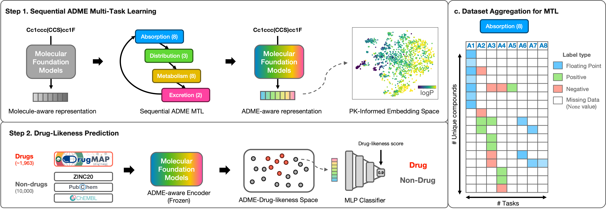

# ADME-Drug-likeness

The official code implementation for *ADME-DL* model from our paper, "ADME-Drug-Likeness: Enriching Molecular Foundation Models via Pharmacokinetics-Guided Multi-Task Learning for Drug-likeness Prediction".

Here, we provide data and codes for Sequential ADME Multi-task learning and Drug-likeness prediction on three datasets (DrugMAP-ZINC, DrugMAP-PubChem, DrugMAP-ChEMBL)

## Model description
ADME-DL model is trained in two steps:

1. **Step 1:** Sequential ADME Multi-task learning which trains the grouped ADME endpoints in A-D-M-E sequential manner. The grouped data for ADME tasks are provided [here](data/ADME/).
2. **Step 2:** Drug-likeness prediction (DLP). This step first encodes the drug-non-drug datasets with the molecular encoder, then trains an MLP model that classifies drugs from non-drugs. The datasetsfor DLP tasks are provided [here](data/DLP/).


## Setup
First, clone this repository and move to the directory.
```
git clone https://github.com/eugenebang/ADME-DL.git
cd ADME-DL/
```

To install the appropriate environment for ADME-DL, you should install [conda](https://docs.conda.io/en/latest/) package manager.

After installing `conda` and placing the `conda` executable in `PATH`, the following command will create `conda` environment named `admedl`. It will take up to 10 minutes to setup the environment, but may vary upon the Internet connection and package cache status.
```
conda env create -f environment.yaml && \
conda activate admedl
```

*However*, we strongly encourage you to first build a fully running virtual environment with adequate `pytorch` and `pytorch_geometric` (along with `torch-scatter`, `torch-cluster` and `torch-sparse`) version for your hardware settings including GPU and CUDA. Then you can install the neccessary packages listed below with `pip` before running the model.

To check whether ADME_DL network works properly, please refer to the codes in `Scoring drug-likeness` below.


## Running ADME-DL
### 1. Scoring drug-likeness

```bash
python score-drug-likeness.py --smiles_file data/demo/demo_molecules.smi
```

`score_drug_likeness.py` file outputs the drug-likeness score computed by ADME-DL model. The input file should be a header-less `.smi` file of SMILES strings with linebreaks (with no column names).

The resulting file, with `.smi` replaced to `_score.csv`, will be saved on the same directory as the input file.


### 2. Training molecular encoder with Sequential ADME MTL
```bash
python train_ADME.py --target_task adme --data_dir data/ADME/
```
Running the code above yields a molecular encoder that is trained through Sequential MTL of ADME tasks in A-D-M-E order. By replacing the `target_task` argument with other pair or orders (e.g. `EMDA` or `A`) will run the training process in the input order.

The trained model is saved in the `ckpts` folder.

### 3. Training Drug-likeness prediction classifier
```bash
python train_DLP.py --ADMEtrained_model ckpts/SeqADME_ADME_DL.pt --data_path data/DLP/drugmap_zinc.csv
```

Running the code above trains the MLP classifier on drug-likeness prediction (DLP) task with drugmap_zinc dataset, with 3:1:1 train-valid-test split. The classifier is trained above the ADME-trained encoder, with its parameters stored in [ckpts folder](ckpts/SeqADME_ADME_DL.pt). The benchmark sets are provided in the [DLP data folder](data/DLP/).


### Software requirements
**Operating system**

 ADME-DL model training and evaluation were tested for *Linux* (Ubuntu 18.04) operating systems.

**Prerequisites**
ADME-DL network training and evaluation were tested for the following python packages and versions.

  - `python`=3.10
  - `pytorch`=1.13.1
  - `pytorch-geometric`=2.2.0
  - `rdkit-pypi`=2022.09.5
  - `numpy`=1.24.1
  - `pandas`=2.1.1
  - `scipy`=1.14.0
  - `tqdm`=4.66.4

# License
The source code of ADME-DL follows [GPL 3.0v license](LICENSE), and allows users to use, modify, and distribute the software freely, even for commercial purposes.

However, any data or content produced from using ADME-DL follows [CC BY-NC-SA 4.0](CC-BY-NC-SA-4.0), which does not permit commercial use without proper authorization.

### References
```
% TDC database
@article{huang2021therapeutics,
  title={Therapeutics data commons: Machine learning datasets and tasks for drug discovery and development},
  author={Huang, Kexin and Fu, Tianfan and Gao, Wenhao and Zhao, Yue and Roohani, Yusuf and Leskovec, Jure and Coley, Connor W and Xiao, Cao and Sun, Jimeng and Zitnik, Marinka},
  journal={arXiv preprint arXiv:2102.09548},
  year={2021}
}

% DrugMAP
@article{li2023drugmap,
  title={DrugMAP: molecular atlas and pharma-information of all drugs},
  author={Li, Fengcheng and Yin, Jiayi and Lu, Mingkun and Mou, Minjie and Li, Zhaorong and Zeng, Zhenyu and Tan, Ying and Wang, Shanshan and Chu, Xinyi and Dai, Haibin and others},
  journal={Nucleic acids research},
  volume={51},
  number={D1},
  pages={D1288--D1299},
  year={2023},
  publisher={Oxford University Press}
}

% GraphMVP
@inproceedings{
    liu2022pretraining,
    title={Pre-training Molecular Graph Representation with 3D Geometry},
    author={Shengchao Liu and Hanchen Wang and Weiyang Liu and Joan Lasenby and Hongyu Guo and Jian Tang},
    booktitle={International Conference on Learning Representations},
    year={2022},
    url={https://openreview.net/forum?id=xQUe1pOKPam}
}

% PCGrad
@misc{Pytorch-PCGrad,
  author = {Wei-Cheng Tseng},
  title = {WeiChengTseng/Pytorch-PCGrad},
  url = {https://github.com/WeiChengTseng/Pytorch-PCGrad.git},
  year = {2020}
}
```
